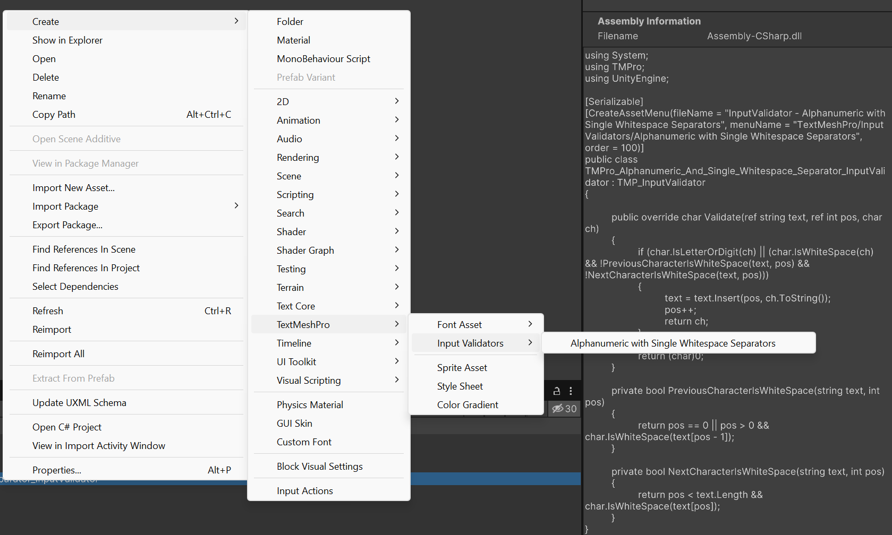

<h1 align="center">Alphanumeric and Whitespace Input Validator for Unity3D's TextMeshPro</h1>

This script adds a *InputValidator* entry to the menu just as with *ScriptableObjects*, once created and assigned to the inputfield it only takes Alphanumeric characters with single Whitespaces between them.

Made it for level names designed by players.

 
 

<h3 align="center">Location in Menu</h3>

  

